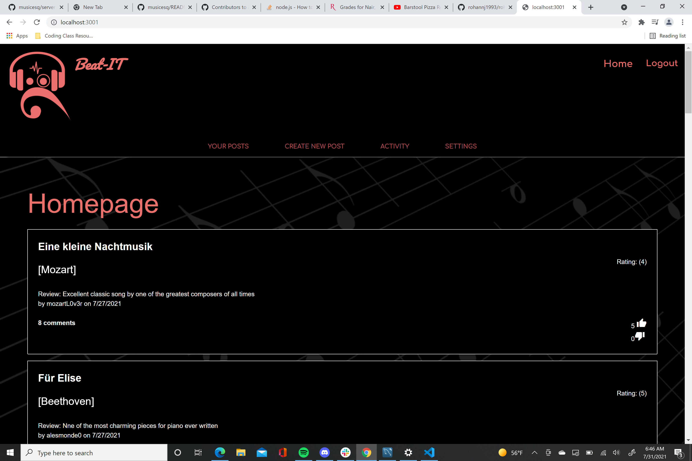

# Beat-IT

## Description
```
This webpage, BEAT IT is based on songs. The website provides a user to post music by searching their favorite song which is connected through Spotify API, write a review about the song, as well as give the song a rating of their choice from 1-5. The user can go to other user's posts and add their comment on the post and also vote thier input of like or dislike. 
```

### Website 
Deployed on Heroku!

[Beat-IT](https://beatit-music-app.herokuapp.com/)

---

## Table of Contents
* [Built With](#built-with)
* [Installation](#installation)
* [User Story](#user-story)
* [Video of App in Action](#video)

---

## Built With
* JavaScript
* CSS
* MySQL
* Sequelize ORM
* Node
* Express
* MVC
* Spotify API

---

## Installation
Clone the Github repo.
```https://github.com/ashryan125/musicesq.git```

Once in the properly cloned folder, run ```npm install``` to install the following dependencies:

 * bcrypt
 * connect-session-sequelize
 * dotenv
 * express
 * express-handlebars
 * express-session
 * materialize-css
 * mysql2
 * nodemon
 * sequelize

---

## User Story
```
AS a user
I NEED to be able to login into a site
and give a random/search song from
Spotify and be able to post a
review comment and vote/comment on other posts
SO THAT I can collaborate with other audiophiles and gain rank with upvotes
```

---

## ScreenShot



---


## Contribution
Made with love by Reuben, Ashley, Sonika and Rohan 


